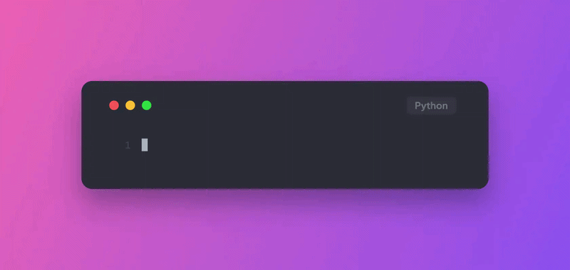

# 🌌 CodeCrafter Advanced
> **The Ultimate 4K Code Snap & Video Studio**

Write code in a beautiful terminal, catch the vibe, and download cinematic 4K snapshots and videos - with absolutely zero limits.

[🚀 Launch Live Codepad](https://sandept.github.io/Code-Crafter/)

---

## ✧ The Vision

**CodeCrafter Advanced** is not just another code beautifier. It is an evolved, highly aesthetic environment designed for developers, educators, and content creators who want to share their code in the highest quality possible.

Inspired by the original Codecraftr, this advanced clone shatters previous limitations. Simply write your code in our immersive Codepad [Terminal], customize the aesthetics, and export your creations in breathtaking 4K resolution (both Images and Videos) with zero restrictions.

---

## ✨ Signature Features

* 🎬 **4K Cinematic Exports:** Download your code snaps and typing animations in crystal-clear 4K.
* ♾️ **Zero Limits:** No watermarks, no paywalls, no daily export limits. Pure freedom.
* 💻 **Immersive Codepad:** A terminal-like experience that feels natural, fast, and responsive.

---

## 🛠️ The Tech Stack

This project was forged using an unconventional and powerful blend of modern tools:

| Technology | Purpose |
| :--- | :--- |
| **Gemini AI** | Core intelligence for code processing and formatting. |
| **AI - Vibe Coding** | Next-gen paradigm for fluid, AI-assisted developer experience. |
| **Prompt Injection** | Advanced contextual instructions to mold the AI outputs perfectly. |
| **Antigravity** | Making the impossible feel lightweight and effortless (`import antigravity`). |

---

## 🚀 Getting Started

### 🌐 Use the Web Version (Recommended)

You don't need to install anything to get started. Experience the full power of CodeCrafter Advanced right in your browser:

👉 **[Launch CodeCrafter Codepad](https://sandept.github.io/Code-Crafter/)**

### 💻 Local Setup (For Contributors)

If you want to run this advanced workspace locally:

```bash
# 1. Clone this repository
git clone https://github.com/sandept/Code-Crafter.git

# 2. Navigate to the directory
cd Code-Crafter

# 3. Open in your favorite live server or browser
# (e.g., using VS Code Live Server or Python HTTP server)
python3 -m http.server 8000
```

### 📸 Preview

```bash
(Imagine a stunning, high-resolution 4K code snippet here!)
JavaScript
// Example of the magic you can create
import { Vibe } from 'codecrafter-advanced';

const myCode = new Vibe({
    language: 'javascript',
    theme: 'Midnight Antigravity',
    resolution: '4K',
    format: 'video' // or 'image'
});

myCode.export(); // Limitless 4K downloads unlocked.
```

---

## 🎥 Demo Preview


---

### 🤝 Acknowledgements & Inspiration

This project is an advanced, unrestricted clone built upon the brilliant foundational ideas of the original Codecraftr. We took the core concept—making code look beautiful—and injected it with AI, 4K rendering capabilities, and an unlimited mindset to push the boundaries of what a code-sharing tool can be.

#### Crafted with ❤️ and 🤖 for the Developer Community.
